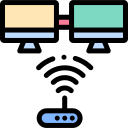

[![Contributors][contributors-shield]][contributors-url]
[![Forks][forks-shield]][forks-url]
[![Stargazers][stars-shield]][stars-url]
[![Issues][issues-shield]][issues-url]
[![MIT License][license-shield]][license-url]
[![LinkedIn][linkedin-shield]][linkedin-url]

  

 

    
    <h2  align="center">Kevoland Environment </h2>
    

        Mi configuración personal de microservicios y aplicaciones dockerizadas, las cuales son útiles para mi en mi servidor on-premise.
         
        <a  href="https://github.com/kevocde/kevoland-env"><strong>Explore the docs »</strong></a>
         
         
        <a  href="https://kevocde.github.io/kevoland-env"  target="_blank">View Demo</a>
        ·
        <a  href="https://github.com/kevocde/kevoland-env/issues">Report Bug</a>
        ·
        <a  href="https://github.com/kevocde/kevoland-env/issues">Request Feature</a>
    

### About The Project
Son todas las configuraciones de microservicios y aplicaciones que tengo montadas en un pequeño servidor en mi hogar, esto con el fin de brindar servicios cómo bloqueo de anuncios,
trasmisión de archivos en red y más cosas que iré añadiendo confirme les vaya encontrando utilidad.

### Built with
- Docker
- Docker Compose
- Pi-Hole
- Samba  

### Getting Started
1.  Clone el respositorio
2. Muevase a la carpeta clonada
3. Ejecute el comando `docker compose up -d`
4. Listo para ser usado.

#### Prerequisites
1. Tener acceso a la configuración del modem para redireccionar los puertos

#### Installation

### License
Distributed under the MIT License. See `LICENSE.txt` file for more information.
See more about this in [Apache License, Version 2.0](https://opensource.org/license/mit/).

  

[contributors-shield]: https://img.shields.io/github/contributors/kevocde/kevoland-env.svg?style=for-the-badge
[contributors-url]: https://github.com/kevocde/kevoland-env/graphs/contributors
[forks-shield]: https://img.shields.io/github/forks/kevocde/kevoland-env.svg?style=for-the-badge
[forks-url]: https://github.com/kevocde/kevoland-env/network/members
[stars-shield]: https://img.shields.io/github/stars/kevocde/kevoland-env.svg?style=for-the-badge
[stars-url]: https://github.com/kevocde/kevoland-env/stargazers
[issues-shield]: https://img.shields.io/github/issues/kevocde/kevoland-env.svg?style=for-the-badge
[issues-url]: https://github.com/kevocde/kevoland-env/issues
[license-shield]: https://img.shields.io/github/license/kevocde/kevoland-env.svg?style=for-the-badge&logo=mit
[license-url]: https://github.com/kevocde/kevoland-env/blob/main/LICENSE.txt
[linkedin-shield]: https://img.shields.io/badge/-LinkedIn-black.svg?style=for-the-badge&logo=linkedin&colorB=555
[linkedin-url]: https://www.linkedin.com/in/kevocode
